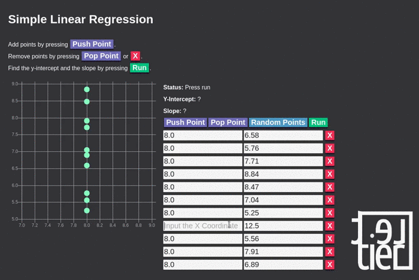

# Interactive Simple Linear Regression

Input 2D data points and fit a simple linear regression model using gradient descent.
Built with [PureScript](http://www.purescript.org/).
Playable at [lettier.com/simple-linear-regression/](http://www.lettier.com/simple-linear-regression/).

## Documentation

For a full write up, visit
[Let's make a Linear Regression Calculator with PureScript](https://lettier.github.io/posts/2017-01-15-linear-regression-and-the-amazing-beard.html).


## Get Started

```bash
git clone git@github.com:lettier/interactive-simple-linear-regression.git
cd interactive-simple-linear-regression
# Install nvm, npm, and yarn.
nvm use
yarn run installPackages
yarn run buildDist
xdg-open dist/index.html
```

(C) 2017 David Lettier  
http://www.lettier.com/
